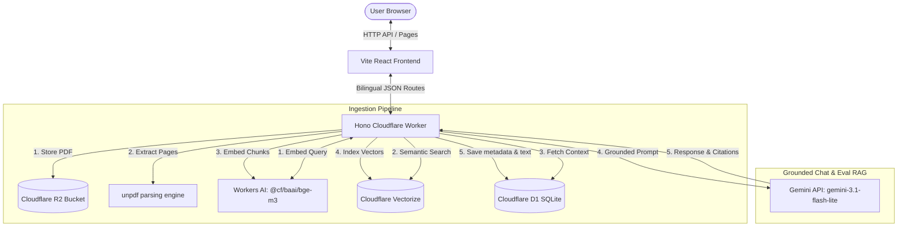

# Mersal (مرسال) 🚀

Mersal (مرسال) is a secure, high-performance, bilingual (Arabic & English) Retrieval-Augmented Generation (RAG) document Q&A platform built natively on the Cloudflare developer ecosystem and powered by Google Gemini.

---

## 📐 Architecture Diagram



---

## 🛠️ Stack Rationale

*   **Frontend (Vite + React + Tailwind)**: Responsive bilingual UI with full LTR (Outfit font) and RTL (Cairo font) layouts. States are synchronized with `localStorage` for visual consistency (no language flash).
*   **Backend (Hono Worker)**: An ultra-lightweight web framework designed for edge runtimes. The production bundle is minified under Cloudflare's **1MB free tier limit** (gzip: **957.54 KiB**) by utilizing lightweight native libraries (`unpdf` in fake-worker mode).
*   **Vector Database (Cloudflare Vectorize)**: Sub-millisecond similarity search using the `@cf/baai/bge-m3` embedding model. Custom session-isolated queries are enforced via metadata indexing.
*   **Relational Database (Cloudflare D1)**: SQLite at the edge, managing document records, parsed text chunks, message history (saving lenient citations), and evaluation cases.
*   **Object Storage (Cloudflare R2)**: Serverless binary object storage hosting uploaded PDFs securely (bucket name: `mersal-uploads`).
*   **LLM Model (Google Gemini 3.1 Flash Lite)**: Highly cost-effective and low-latency API used for both grounded chat generations and evaluation judging.

---

## 🚀 Local Setup & Configuration

### Prerequisites
- Node.js (v18+)
- Cloudflare Account

### Step-by-Step Installation

1. **Clone the Repository & Install Dependencies**:
   ```bash
   npm install
   ```

2. **Log in to Cloudflare CLI**:
   ```bash
   npx wrangler login
   ```

3. **Recreate a Clean Local/Prod Vectorize Index**:
   If you have active/orphaned dev vectors in your index, delete it and recreate it cleanly before any inserts:
   ```bash
   # 1. Delete existing index
   npx wrangler vectorize delete mersal-vectors --force

   # 2. Create index
   npx wrangler vectorize create mersal-vectors --dimensions=1024 --metric=cosine

   # 3. Create metadata index (session isolation)
   npx wrangler vectorize create-metadata-index mersal-vectors --property-name=session_id --type=string
   ```

4. **Configure API Secrets**:
   Create a `.dev.vars` file in the `api` folder and add your Gemini API Key:
   ```env
   GEMINI_API_KEY=your_google_gemini_api_key
   ```

5. **Initialize the local D1 Database**:
   Apply migrations to create schemas and seed the 20 real evaluation cases:
   ```bash
   npm run db:migrate:local
   ```

6. **Run the local Development Servers**:
   ```bash
   npm run dev
   ```
   *Note: Local development binds to the production Vectorize index using the `--experimental-vectorize-bind-to-prod` flag since local Vectorize metadata filtering is not supported natively by Miniflare.*

---

## 🌐 Production Deployment & Frontend-to-API Wiring

Because Vite dev proxies do not run on Cloudflare Pages in production, cross-origin requests must be wired explicitly.

### 1. Build and Deploy the Backend Worker
1. Create a production D1 database:
   ```bash
   npx wrangler d1 create mersal-db
   ```
   *Copy the `database_id` returned and update the `[[d1_databases]]` binding in `api/wrangler.toml`.*

2. Run D1 production migrations:
   ```bash
   npx wrangler d1 migrations apply mersal-db --remote
   ```

3. Deploy Vectorize and R2:
   ```bash
   # Create Vectorize production index & metadata
   npx wrangler vectorize create mersal-vectors --dimensions=1024 --metric=cosine
   npx wrangler vectorize create-metadata-index mersal-vectors --property-name=session_id --type=string

   # Create R2 production bucket (matches bucket_name in wrangler.toml)
   npx wrangler r2 bucket create mersal-uploads
   ```

4. Add Production Environment Secrets:
   Set the API secrets in your live worker environment:
   ```bash
   # Add Gemini API key
   npx wrangler secret put GEMINI_API_KEY
   
   # Add your production Pages origin (e.g. https://mersal.pages.dev) to restrict CORS access:
   npx wrangler secret put ALLOWED_ORIGIN
   ```

5. Deploy the backend worker code:
   ```bash
   npm run deploy --workspace=api
   ```
   *Note the deployed Worker URL (e.g., `https://mersal-api.username.workers.dev`).*

### 2. Build and Deploy the Frontend Pages
1. Build the Vite production bundle, passing your Worker's deployed URL as `VITE_API_URL`:
   ```bash
   # Windows (PowerShell)
   $env:VITE_API_URL="https://mersal-api.username.workers.dev"; npm run build --workspace=web
   
   # Linux/macOS (bash)
   VITE_API_URL="https://mersal-api.username.workers.dev" npm run build --workspace=web
   ```

2. Deploy the build output directory (`web/dist`) to Cloudflare Pages:
   ```bash
   npx wrangler pages deploy web/dist
   ```

---

## 📈 Evaluation Harness & Pacing

Mersal includes an automated RAG evaluation dashboard containing **20 real cases** (10 English, 10 Arabic) matched to employee handbooks (`mersal-test-english.pdf` and `mersal-test-arabic-multipage.pdf`).

*   **Pacing Delay**: Frontend sequentially schedules evaluation requests with a strict **9-second delay** between cases to respect Gemini's sliding 10 RPM free-tier limit.
*   **Backoff Retries**: Handles `429`, `500`, and `503` codes by executing exponential retries with backoff delays of **10s, 20s, and 40s** for the judge model.
*   **UI Abort**: Pulsing manual abort button terminates loop immediately. Loop auto-aborts if **3 consecutive daily quota failures** occur.

---

## 🧪 Post-Deploy Smoke Test Checklist

Once the production deployment is complete, verify the live platform using the following steps:

1. **Verify PDF Extraction & CPU Limits**:
   - Upload both `mersal-test-english.pdf` and `mersal-test-arabic-multipage.pdf` on your live Pages URL.
   - Confirm status transitions to `Ready`.
   - *Flag: If the PDF extraction fails (status: Failed) or times out (HTTP 504), check your Worker logs using `npx wrangler tail`. In production, the Worker free tier enforces a strict 50ms CPU execution cap. If complex PDFs exceed this CPU budget, you must upgrade your Cloudflare Worker plan to the paid Tier (which allows up to 30s CPU limit).*
2. **Test English Q&A with Citations**:
   - Ask: `"What is the minimum internet speed required for remote work?"`
   - Confirm the answer is returned successfully, matches the handbook contents (25 Mbps), and includes the clickable page-citation `[mersal-test-english.pdf, p.1]`.
3. **Test Arabic Q&A with Citations**:
   - Ask: `"كم يوماً تبلغ الإجازة السنوية للموظف؟"`
   - Confirm the answer is returned successfully, matches the handbook contents (21 days), and includes the page-citation `[mersal-test-arabic-multipage.pdf, p.1]`.
4. **Test Evaluation Case**:
   - Navigate to the **Evaluation Dashboard** tab.
   - Click the single-case **Refresh/Re-run** button (e.g. for case `ec-en-01`).
   - Confirm the case executes individually, shows a green `Passed` badge (or detailed failure justification if context differs), and writes results to the table.
5. **Test Document Deletion**:
   - Return to the **Documents** tab and delete `mersal-test-english.pdf`.
   - Confirm the list updates immediately, the document is deleted, and its chunk vectors are wiped from Vectorize.
